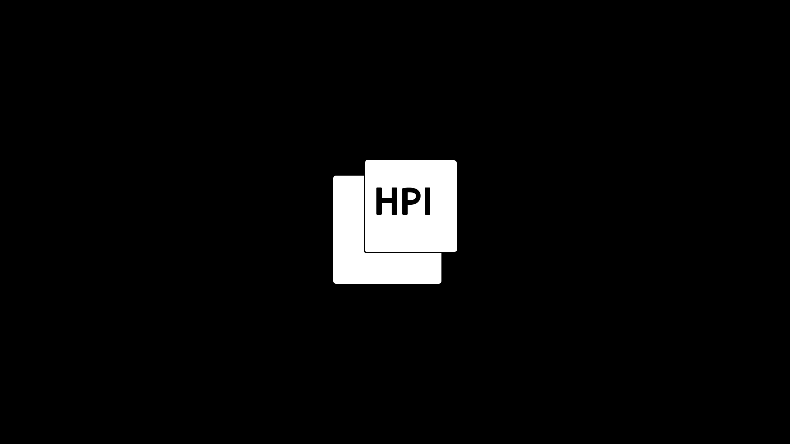

# HPI-Vorkurs 2024

Willkommen zum **HPI-Vorkurs 2024**! In diesem Repository findet ihr alle Übungsblätter und Materialien, welche im Vorkurs ausgeteilt werden im handlichen digitalen Format.

## 📚 Inhalt

### Woche 1

- [Tag 1: Mengen und Zahlen](./woche-1/tag-1/aufgaben.pdf)
- [Tag 2: LaTeX und mehr Brüche](./woche-1/tag-2/aufgaben.pdf)
- [Tag 3: Lineare Gleichungssysteme](./woche-1/tag-3/aufgaben.pdf)
- [Tag 4: Logarithmen und Potenzen](./woche-1/tag-4/aufgaben.pdf)
- [Tag 5: Rätsel und Primfaktorzerlegung](./woche-1/tag-5/aufgaben.pdf)

### Woche 2

- [Tag 1: Computer & Terminal](./woche-2/tag-1/aufgaben.pdf)
- [Tag 2: Ableiten](./woche-2/tag-2/aufgaben.pdf)
- [Tag 3: Ableiten](./woche-2/tag-3/aufgaben.pdf)
---

## 🔗 Wichtige Links

- [Kurzskript zum Vorkurs](https://hpi.de/friedrich/docs/scripts/24_Vorkurs/index.html)
